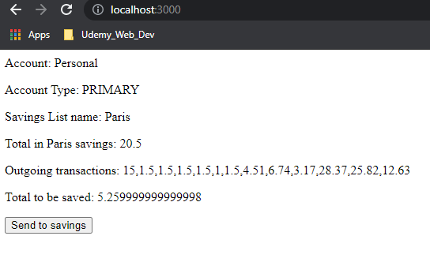
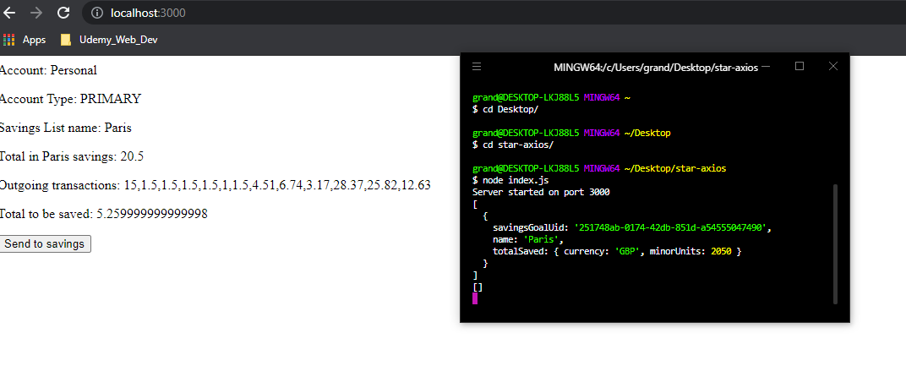
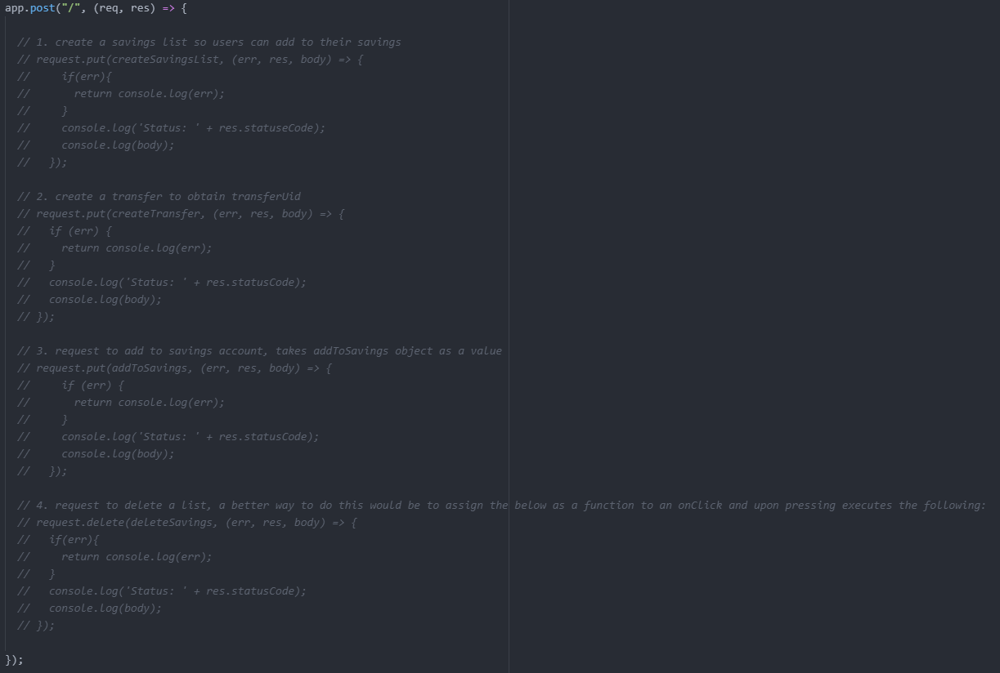
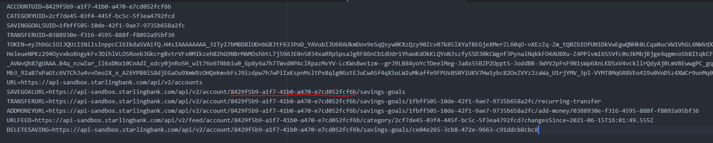
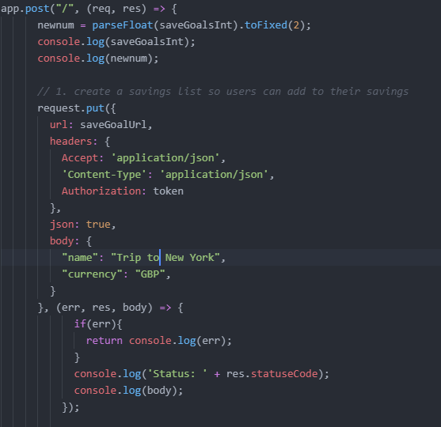
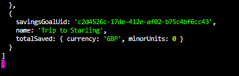
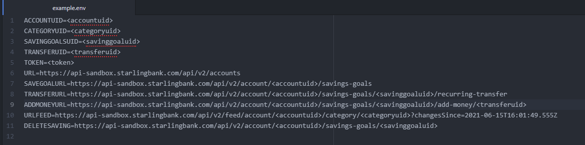

# STARLING TECH TEST GRADUATE

PLEASE MAKE SURE TO CHECK THE *GUIDE TO MAKE CODE WORK*

The application was built using HTML, Node.js, Express along with EJS(Backend). Most things are hardcoded just to make it easier to test.

Landing page: Shows all data that is related to the account(s), account type, Savings List (if created), total saved in that savings list, outgoing transactions and the rounded up amount of Outgoing
transactions. The button is used to send the rounded amount to the savings.

Example page: Displaying both landing page and backend logs of current savings lists data

Read more page: Order to make the application work is listed below in the snippet of code, uncomment one by one with correct UID's for corresponding URL's and UID's.

<h1>Instructions & How to use the app</h1>
<ol>
  <li>cd into the app root directory in your terminal</li>
  <li>Run npm i command</li>
  <li>Run npm i axios request ejs body-parser</li>
  <li>open app in browser on localhost:3000</li>
  <li>Code relies on .env file to load UID's and URL's that need to be protected</li>
  </ol>

<h1>Summary</h1>
This web application takes all transactions ands rounds them to the nearest pound, this value is then transferred into a savings goal. The application uses Express, axios, request, EJS and bodyParser to achieve its results.

<h1>GUIDE TO MAKE CODE WORK</h1>
<ol>
  <li>Make sure to update the .env page with corresponding URLS/UIDS as you go along</li>
  <li>Uncomment first section to create a savings list and update .env file accordingly, run code and press send to show result</li>
  <li>Comment section 1</li>
  <li>Repeat above steps for section 2, 3 and 4(optional delete</li>
  </ol>

I have also provided an example.env file for you to follow the format for your own UID's/URL's

<h1>Author</h1>
Ibrahim Akbar
